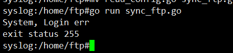
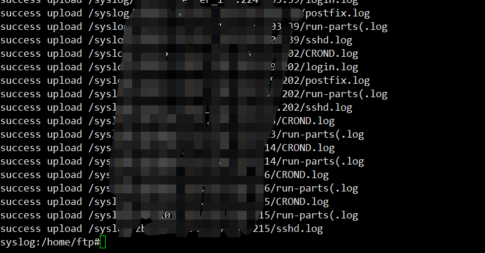

# 配置信息
<pre><code>
[path]
   file_path         = /tmp   //本地同步的目录,可以写多个
[ftp]
   ftpfile_path     = /    //ftp服务器上的目录 
   ftp_server_ip    = xxxx  //服务器ip
   ftp_server_port  = 21                     
   ftp_server_name  = xxx      //账号
   ftp_server_pwd   = xxx      //密码         
   local_ip         = 192.168.56.1    //这个留着以后用 
   local_port       = 80             //这个留着以后用 
   comm_way         = udp             //ftp协议    
[file]
   file_log         = .log          //支持同步的文件类型
   log_print        = ture          //是否开启日志输出
</code></pre>
* * *
# 语法
 例如[path] [file] 这个可以写多个配置地址
 
 * * *
 # 调用
 <pre><code>
    ftpConfig := new(Config)
    ftpConfig.InitConfig("config.ini")
    sync_path := ftpConfig.Read("path", "file_path")
    sync_type := ftpConfig.Read("file", "file_log")
    sync_path_jpg := ftpConfig.Read("path", "file_path_jpg")
    sync_type_jpg := ftpConfig.Read("file", "file_jpg")
    WalkDir(sync_path, sync_type)
    WalkDir(sync_path_jpg, sync_type_jpg)
</code></pre>
* * *
  
  
 
